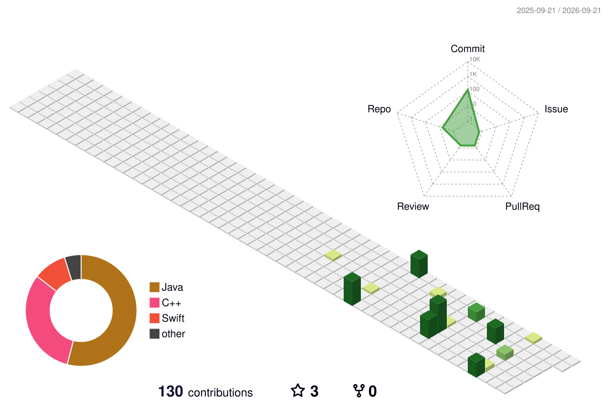

# Crossng

`macOS apps` · `Java services` · `visual computing`

  
  

## About

你好，我是 Crossng。我主要写 Swift 和 Java，偶尔用 Python 做视觉相关的实验。

我喜欢做小而具体的东西：一个能长期放在菜单栏里的工具、一个边界清楚的服务，或者一个把想法验证出来的实验项目。

## Selected repositories

| Repository | Notes | Stack |
| --- | --- | --- |
| [Mac-TrafficBar](https://github.com/Crossng/Mac-TrafficBar) | macOS 菜单栏流量监控工具 | Swift · macOS |
| [code-review-agent](https://github.com/Crossng/code-review-agent) | 代码审查与开发流程服务 | Java · Spring Boot |
| [lingbot-map](https://github.com/Crossng/lingbot-map) | 场景重建与 3D 数据探索 | Python · Computer Vision |
| [Vggt](https://github.com/Crossng/Vggt) | Visual Geometry 项目实验 | Python · PyTorch |

## Toolbox

  

### Java / JVM

  
  
  
  
  
  

### Infrastructure

  
  
  
  
  

### Contribution views

<picture>
  <source media="(prefers-color-scheme: dark)" srcset="./profile-3d-contrib/profile-night-rainbow.svg" />
  <source media="(prefers-color-scheme: light)" srcset="./profile-3d-contrib/profile-season.svg" />
  
</picture>

### One small animation

<picture>
  <source media="(prefers-color-scheme: dark)" srcset="https://raw.githubusercontent.com/Crossng/Crossng/output/github-contribution-grid-snake-dark.svg" />
  <source media="(prefers-color-scheme: light)" srcset="https://raw.githubusercontent.com/Crossng/Crossng/output/github-contribution-grid-snake.svg" />
  
</picture>

Thanks for stopping by.

