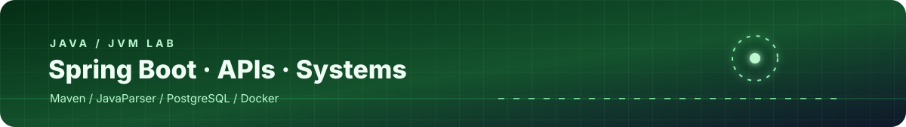

  
  
  

<em>你好，我是 Crossng。我喜欢把遇到的问题，慢慢做成顺手的工具。</em>

## Hi, I'm Crossng

Most of my current work sits between desktop utilities, Java services, and computer vision experiments. I care about clear interfaces, readable code, and software that solves a real problem before it tries to look impressive.

  

## Things I like to build

<table>
  <tr>
    <td width="33%" valign="top">
      <h3>macOS utilities</h3>
      
Small native tools that stay out of the way and make everyday work faster.

    </td>
    <td width="33%" valign="top">
      <h3>Java services</h3>
      
Backend systems with a clear boundary between business logic, data, and operations.

    </td>
    <td width="33%" valign="top">
      <h3>3D experiments</h3>
      
Exploring how visual data can become useful structure, maps, and interfaces.

    </td>
  </tr>
</table>

## Selected work

| Project | What it is | Main stack |
| --- | --- | --- |
| [Mac-TrafficBar](https://github.com/Crossng/Mac-TrafficBar) | 原生 macOS 菜单栏流量监控工具 | Swift · macOS |
| [code-review-agent](https://github.com/Crossng/code-review-agent) | 面向代码审查与开发流程的 Java 服务 | Java · Spring Boot · Maven |
| [lingbot-map](https://github.com/Crossng/lingbot-map) | 从流式数据中重建场景的 3D 基础模型探索 | Python · Computer Vision |
| [Vggt](https://github.com/Crossng/Vggt) | Visual Geometry Grounded Transformer 项目探索 | Python · PyTorch |

  

## Toolbox

  

### Java / JVM

  
  
  
  
  
  

### Infrastructure

  
  
  
  
  

## Contributions

<picture>
  <source media="(prefers-color-scheme: dark)" srcset="./profile-3d-contrib/profile-night-rainbow.svg" />
  <source media="(prefers-color-scheme: light)" srcset="./profile-3d-contrib/profile-season.svg" />
  
</picture>

  
<strong>One small animation</strong>

   
  <picture>
    <source media="(prefers-color-scheme: dark)" srcset="https://raw.githubusercontent.com/Crossng/Crossng/output/github-contribution-grid-snake-dark.svg" />
    <source media="(prefers-color-scheme: light)" srcset="https://raw.githubusercontent.com/Crossng/Crossng/output/github-contribution-grid-snake.svg" />
    
  </picture>

### Thanks for stopping by 👋

Build small things. Make them useful. Keep learning.

